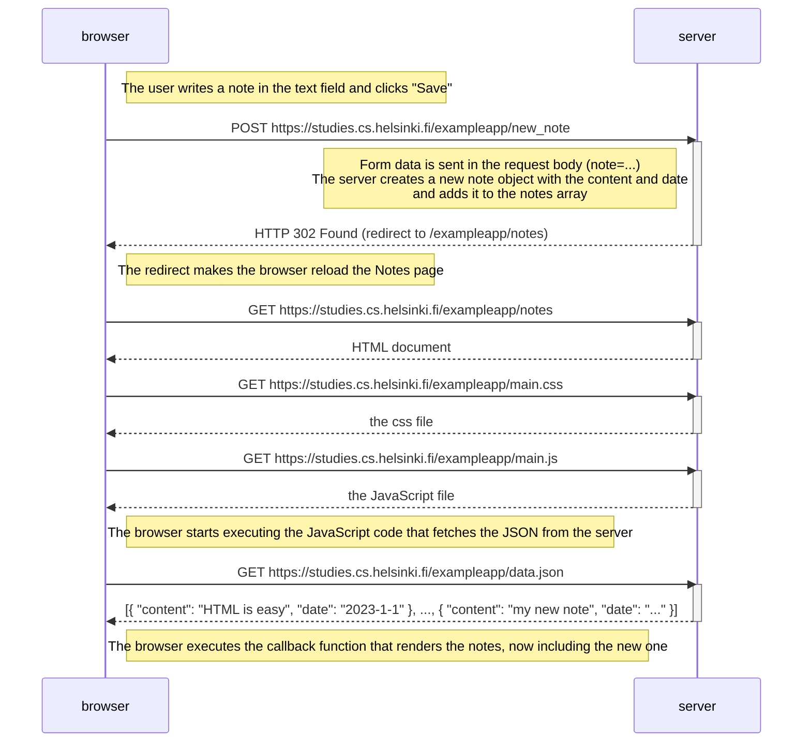

# 0.4: New note diagram

The user writes something into the text field on https://studies.cs.helsinki.fi/exampleapp/notes and clicks the **Save** button.

```mermaid
sequenceDiagram
    participant browser
    participant server

    Note right of browser: The user writes a note in the text field and clicks "Save"

    browser->>server: POST https://studies.cs.helsinki.fi/exampleapp/new_note
    activate server
    Note left of server: Form data is sent in the request body (note=...)<br/>The server creates a new note object with the content and date<br/>and adds it to the notes array
    server-->>browser: HTTP 302 Found (redirect to /exampleapp/notes)
    deactivate server

    Note right of browser: The redirect makes the browser reload the Notes page

    browser->>server: GET https://studies.cs.helsinki.fi/exampleapp/notes
    activate server
    server-->>browser: HTML document
    deactivate server

    browser->>server: GET https://studies.cs.helsinki.fi/exampleapp/main.css
    activate server
    server-->>browser: the css file
    deactivate server

    browser->>server: GET https://studies.cs.helsinki.fi/exampleapp/main.js
    activate server
    server-->>browser: the JavaScript file
    deactivate server

    Note right of browser: The browser starts executing the JavaScript code that fetches the JSON from the server

    browser->>server: GET https://studies.cs.helsinki.fi/exampleapp/data.json
    activate server
    server-->>browser: [{ "content": "HTML is easy", "date": "2023-1-1" }, ..., { "content": "my new note", "date": "..." }]
    deactivate server

    Note right of browser: The browser executes the callback function that renders the notes, now including the new one
```
