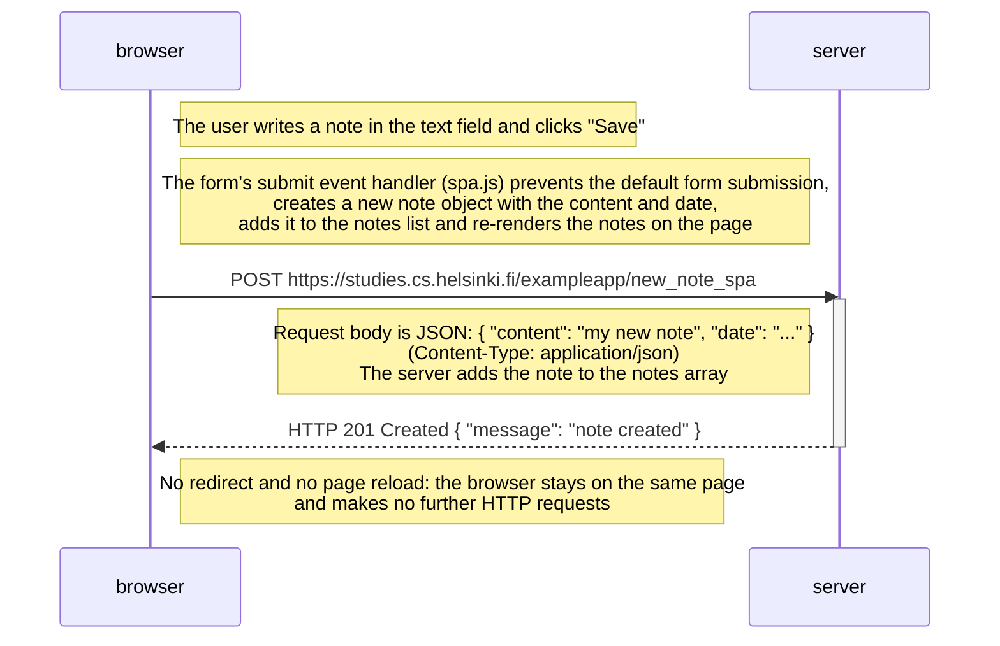

# 0.6: New note in Single page app diagram

The user writes something into the text field on https://studies.cs.helsinki.fi/exampleapp/spa and clicks the **Save** button.

```mermaid
sequenceDiagram
    participant browser
    participant server

    Note right of browser: The user writes a note in the text field and clicks "Save"

    Note right of browser: The form's submit event handler (spa.js) prevents the default form submission,<br/>creates a new note object with the content and date,<br/>adds it to the notes list and re-renders the notes on the page

    browser->>server: POST https://studies.cs.helsinki.fi/exampleapp/new_note_spa
    activate server
    Note left of server: Request body is JSON: { "content": "my new note", "date": "..." }<br/>(Content-Type: application/json)<br/>The server adds the note to the notes array
    server-->>browser: HTTP 201 Created { "message": "note created" }
    deactivate server

    Note right of browser: No redirect and no page reload: the browser stays on the same page<br/>and makes no further HTTP requests
```
